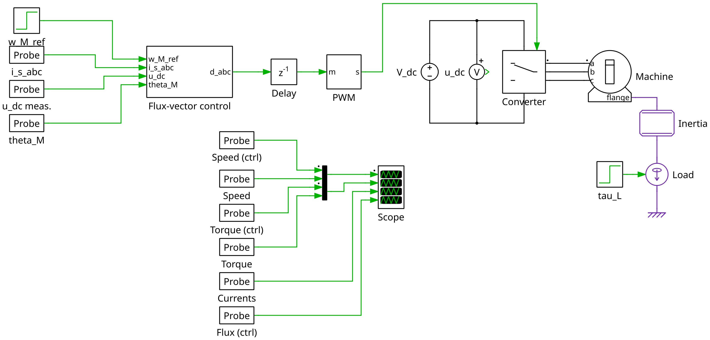
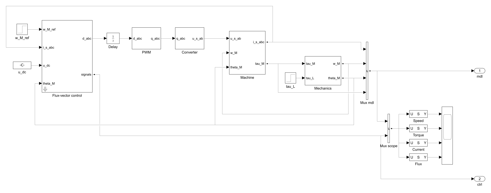

# motulator-export

Export [motulator](https://github.com/Aalto-Electric-Drives/motulator) drive systems and grid converter systems to [PLECS](https://www.plexim.com/products/plecs) and [Simulink](https://www.mathworks.com/products/simulink.html).

You build a system in motulator, as usual, and get a ready-to-run simulation model of it:

- **The same control code in both tools.** The control algorithms of motulator are ported to C, and the same C code runs in a C-Script block in PLECS and in a generated S-function in Simulink. The C port is tested against motulator step by step.
- **Parameters as in motulator.** The control system is a masked subsystem whose parameters are those of the motulator API (e.g., `SynchronousMachinePars`, `FluxVectorControllerCfg`, and `SpeedController`), including the defaults. The models are self-contained: you can change the parameters in the mask without Python.
- **Verified against motulator.** The system model (the machine, the mechanics, the converter, and the grid) is built from native blocks, and the example scripts simulate each system in both tools and in motulator. The results agree to about 1e-6 relative to the signal magnitudes (1e-4 with the GradNet models, which motulator evaluates in single precision).

<picture>
  <source media="(prefers-color-scheme: dark)" srcset="examples/pmsyrm_6kw_gn_fvc_black.png">
  
</picture>

*PLECS model of a 5.6-kW PM-SyRM drive written by [examples/pmsyrm_6kw_gn_fvc.py](examples/pmsyrm_6kw_gn_fvc.py): the flux-vector control subsystem, the computational delay, the PWM, the converter, the machine with a GradNet model, the mechanics, and the scope.*

<picture>
  <source media="(prefers-color-scheme: dark)" srcset="examples/pmsyrm_6kw_gn_fvc_simulink_black.png">
  
</picture>

*Simulink model of the same drive written by [examples/pmsyrm_6kw_gn_fvc_simulink.py](examples/pmsyrm_6kw_gn_fvc_simulink.py), with the same C code of the control system in an S-function. The output ports `mdl` and `ctrl` give the signals for the comparison with motulator.*

## Installation

```bash
pip install git+https://github.com/Aalto-Electric-Drives/motulator-export
```

This requires Python 3.12 or later and motulator 0.8.0 or later. In addition, you need:

- **PLECS**: PLECS Standalone. To simulate from Python, enable the RPC interface (Preferences > General > RPC interface, port 1080).
- **Simulink**: MATLAB with Simulink (no other toolboxes) and a C compiler that supports `complex.h`: gcc (Linux), clang (macOS), or MinGW-w64 (Windows: the add-on *MATLAB Support for MinGW-w64 C/C++ Compiler*, selected with `mex -setup C`). MSVC does not work. To simulate from Python, install the MATLAB Engine API for Python matching your MATLAB release (e.g., `pip install matlabengine==26.1.*` for R2026a).

## Quick start

Build the system in motulator and write the model:

```python
from motulator_export import StepSignal, plecs, simulink

# mdl, ctrl: a motulator drive (model.Drive) and its control system
# (control.VectorControlSystem), e.g., from examples/ipmsm_2kw_fvc.py
w_M_ref = StepSignal(time=0.1, after=50)  # Speed reference (rad/s)
tau_L = StepSignal(time=0.7, after=10)  # Load torque (Nm)
speed_ctrl_args = {"J": 0.015, "alpha_s": 25}  # Arguments of SpeedController

plecs.sm.write_model("ipmsm.plecs", mdl, ctrl, w_M_ref, tau_L, 1.2, speed_ctrl_args)
simulink.sm.write_model("ipmsm.slx", mdl, ctrl, w_M_ref, tau_L, 1.2, speed_ctrl_args)
```

The PLECS model `ipmsm.plecs` opens directly in PLECS.
For Simulink, the writer creates the MATLAB script `build_ipmsm.m` (and the C source of the S-function) in the same folder: running the script in MATLAB compiles the S-function and saves `ipmsm.slx`.

The modules `sm` (synchronous machine drives), `im` (induction machine drives), and `grid` (grid converter systems) are the same in `plecs` and `simulink`.
Each provides `write_model` and `simulate`, which runs the model from Python and returns its signals.

## Examples

The [examples](examples/) build the systems of the motulator examples, write the models, and, if the tool is available, simulate them both in the tool and in motulator and print the maximum differences.
Run them from the repository root, e.g., `python examples/ipmsm_2kw_fvc.py`.

| System                                                            | PLECS                                        | Simulink                        |
| ----------------------------------------------------------------- | -------------------------------------------- | ------------------------------- |
| 2.2-kW IPMSM, sensorless flux-vector control                      | `ipmsm_2kw_fvc.py` (`--diode`: diode bridge) | `ipmsm_2kw_fvc_simulink.py`     |
| 5.6-kW PM-SyRM, GradNet models from FEM data, flux-vector control | `pmsyrm_6kw_gn_fvc.py`                       | `pmsyrm_6kw_gn_fvc_simulink.py` |
| 2.2-kW induction machine, sensorless current-vector control       | `im_2kw_cvc.py`                              | `im_2kw_cvc_simulink.py`        |
| 10-kVA grid converter, LCL filter, grid-following control         | `gfl_10kva_lcl.py`                           | `gfl_10kva_lcl_simulink.py`     |
| 12.5-kVA grid converter, weak grid, grid-forming control          | `gfm_13kva_do.py`                            | `gfm_13kva_do_simulink.py`      |

## Supported systems

| Feature                                                                                                 | PLECS | Simulink |
| ------------------------------------------------------------------------------------------------------- | :---: | :------: |
| Synchronous machine drives: flux-vector control (constant inductances or GradNet models), speed control |  yes  |   yes    |
| Induction machine drives: current-vector control (constant parameters), speed control                   |  yes  |   yes    |
| Grid-following control with an LCL filter (without resistances and grid impedance)                      |  yes  |   yes    |
| Grid-forming control (disturbance observer) with an L filter and the grid inductance                    |  yes  |   yes    |
| Stiff DC bus                                                                                            |  yes  |   yes    |
| Capacitive or diode-bridge-fed DC bus                                                                   |  yes  |    no    |

The drives can be sensorless or sensored, the converter uses carrier comparison (`pwm=True`), and the grid is balanced with constant voltage and frequency.
Other configurations raise `NotImplementedError` when the model is written.

## Working with the models

- **Control parameters** are in the mask of the control-system subsystem, named after the control method (e.g., `Flux-vector control`), on tabs corresponding to the motulator API. An empty parameter (`[]`) corresponds to `None` in motulator, i.e., the default. Derived quantities, such as the gains and the lookup tables, are computed by the C code at the start of the simulation.
- **System parameters** (e.g., `machine`, `mechanics`, and `converter`) are in the initialization commands of the PLECS model (Simulation > Simulation Parameters > Initialization) and in the model workspace of the Simulink model.
- **C sources**: the models refer to the C files of the package by a path relative to the model file, so write the model again if you move it relative to the package.
- **Simulink**: a compiled S-function stays loaded in MATLAB after its model is closed, so run `clear mex` before rebuilding a model that was open.

## Documentation

- [examples/README.md](examples/README.md): the structure of the PLECS models and their agreement with motulator
- [motulator_export/simulink/README.md](motulator_export/simulink/README.md): the Simulink export, the structure of the models, and their agreement with motulator
- [motulator_export/c/README.md](motulator_export/c/README.md): the C port of the control algorithms and its tests

## Development

Clone the repository and install it in editable mode with the development tools, `pip install -e .[dev]`.
The tests (`pytest`) compile the C sources with gcc and compare the C port and the generated S-functions with motulator; neither PLECS nor MATLAB is needed.
On Windows, the MinGW-w64 gcc of MATLAB can be used by adding its `bin` folder to the PATH.

## License

[MIT](LICENSE)
